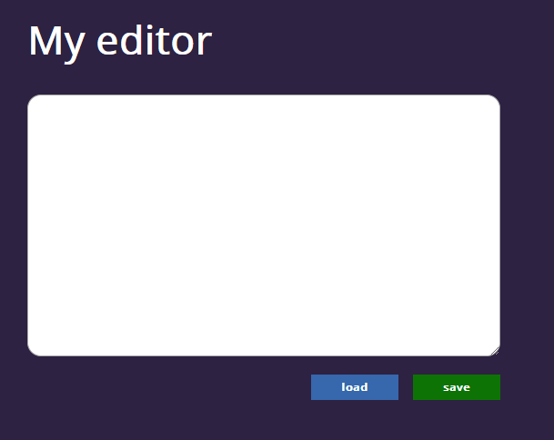

# Simple-editor

 Strona dostępna [tutaj](https://maciejboniaszczuk.github.io/simple-editor/)

Przycisk **SAVE** zapsiuje w Local Storage tekst wpisany przez użytkownika

Po naciśnięciu przycisku **LOAD** zostaje wczytana wartość z Local Storage

## Jak uruchomić stronę lokalnie

Aby uruchomić stronę lokalnie wykonaj poniższe polecenia.

`npm install -g gulp-cli`

`npm install`

`gulp`
